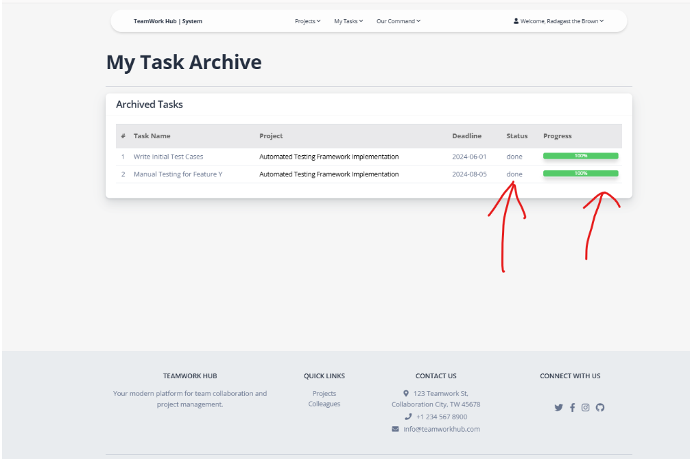

# TeamWork Hub  
## *Task Tracker / Project Team Manager for IT Company*

---

## 1. Description

**TeamWork Hub** is an application designed for managing projects within IT teams. It allows users to:

- Create teams via a unique 10-character team code  
- Assign tasks based on team roles  
- Track task progress  
- Perform code reviews  
- Archive completed tasks and projects  

**Team structure:**

- `Leader` — full CRUD permissions and review access  
- `Member` — limited access, assigned tasks only  

**Directions supported:**

- Development  
- Backend  
- Design  
- Project Management  
- QA  
- Team Lead  

---

## 2. Features

✅ Team registration via unique 10-character code  
🔐 Role-based access: Leader vs Member  
🛠️ Full CRUD for Leaders (projects & tasks)  
🧩 Task assignment by direction (Frontend, Backend, QA, etc.)  
📊 Progress tracking with status updates and percentage  
🔄 Code Review system and task archiving  
🗂️ Project and Task Archives  
👥 Team overview and editable member info (Leader only)  
🔎 Search & filter by project title and direction  
📎 GitHub solution links in task details  
📱 Responsive and intuitive interface  

---

## 3. Diagram

---

## 4. Screenshots with Detailed Description of Functionality

### 📝 Registration

Users enter:
- First & last name  
- Email & password  
- 10-character team code  
- Direction (Frontend, Backend, etc.)

**Leader:** first to register using team code  
**Member:** everyone else joining the same team code

  
**Direction selection:**  

---

### 🔐 Login Page

After registration, users log in with their credentials.

---

### 🏠 Home Page

Displays:
- Total team members  
- Active projects  
- User's completed tasks  

Includes a navigation panel:

  
**Leader view:**  

**Tabs overview:**
- Projects → "Projects List"  
  

- (Leader only) Review Tasks → "Pending Review"  
  

- My Tasks → "Current" & "Archived"  
  

- Our Command → "Team Members" & "Project Archive"  
  

- Welcome {Name} → Sign Out  
  

---

## 📁 Projects

Users see projects from their direction only.  
Leaders can create new projects.

  
  

**Search by title:**  

Each project includes:
- Details  
- Tasks  

---

### 📄 Project Details

Shows all project info and linked tasks.  
Leaders can update, archive, or delete.

  
  
**Update confirmation:**  
  
**Delete confirmation:**  

---

### ✅ Tasks in Project

Displays:
- Type, status, deadline, progress  
- "My Task" label for assigned tasks  

  
**Leader view:**  

---

### 📌 Task Details

If unassigned + status = "To Do" → “Assign Me” button shown.  
After assignment → status updates to "In Progress".

  
Additional options appear:
- Unassign  
- Change status  
- Add GitHub link  

  

Once task is 100% done → status set to `75% - code review`, and sent to review list.

  
Leader's view:  

---

## 🧪 Review Tasks (Leader Only)

Tasks under code review with:
- User name  
- Solution link  
- Project name  

**"Confirm & Archive"** button marks the task as completed and archives it.

---

## 🧑‍💻 My Tasks

### - Current Tasks

Tasks assigned or self-assigned by user.

### - Task Archive

Tasks marked `Done` or `Review`, including project links.

  
  

---

## 🧑‍🤝‍🧑 Our Command

### - Team Members

Displays all team members and their departments.  
Leaders can edit incorrect info.

  
  
**Details:**  
  

**Leader’s view:**  
  
  

---

## 📦 Project Archive

Displays completed projects.  
Details view available.

  

---

## 🔚 Logout

Hover over "Welcome {username}" to reveal the **Sign Out** option.  
Logs out the user and redirects to the login page.

---
# 5. ⚙️ Getting Started

### 📦 Prerequisites

- Python 3.10+
- PostgreSQL (or SQLite for local)
- pip
- virtualenv (recommended)

### 🔧 Installation

## Clone the repo
git clone https://github.com/stager0/teamwork-hub.git
cd teamwork-hub

## Create and activate virtual environment
python -m venv venv
source venv/bin/activate  # On Windows: venv\Scripts\activate

## Install dependencies
pip install -r requirements.txt

## Apply database migrations
python manage.py migrate

## 👤 Create a Superuser (for Admin Access)

python manage.py createsuperuser

or load test data using:

python manage.py loaddata fixture.db.json

## Run the development server
python manage.py runserver

## Run all unit tests
python manage.py test